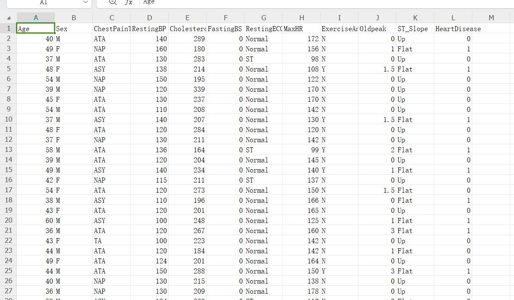

# Heart Failure Dataset in CSV Format

Cardiovascular disease (CVD) is the leading cause of death worldwide, claiming approximately 17.9 million lives each year, accounting for 31% of all global deaths.

4/5 of CVD deaths result from heart attacks and strokes, with one-third of premature deaths occurring in individuals under the age of 70.

Individuals with cardiovascular diseases or high cardiovascular risk factors (due to one or more risk factors such as hypertension, diabetes, hyperlipidemia, or established diseases) need early detection and management.

This task aims to predict potential heart failure patients for early identification and management.

## Images

Here is a pay link on Stripe ( https://buy.stripe.com/3cs8yP7sY87d0vu9AB ). Please contact me lonlonago@foxmail.com after funding $89, and I will send you a complete data files , thank you!

